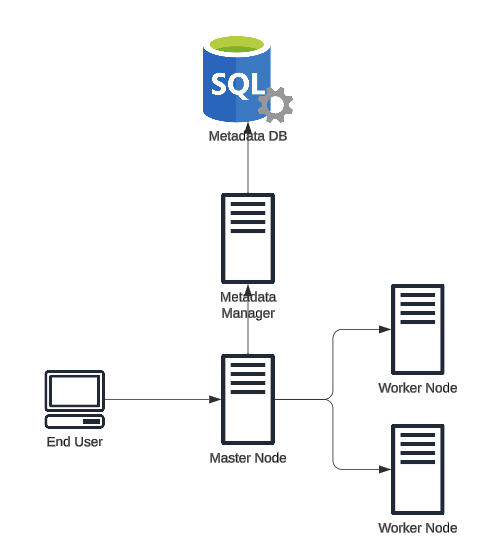

# Distributed File System

This project aims to simulate an enterprise level file management system that incorporates the ability to make updates to files via REST endpoints, the ability to partition large files while storing, the ability to recombine the partitions while retrieving, and the basis for file partion replication with fault tolerance.

---

### System Architecture:

The end user is able to send requests to the Master Node which handles file partitioning. Once files are partitioned, they are sent downstream to the worker nodes to be stored. The Metadata Manager is also called to update the DB which will track file partitions and locations.

